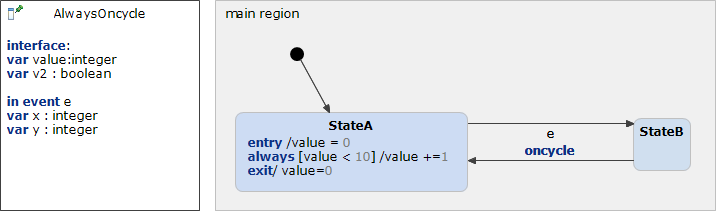

# AlwaysOncycle 



```xml
<?xml version="1.0" encoding="UTF-8"?>
<scxml xmlns="http://www.w3.org/2005/07/scxml" version="1.0" datamodel="ecmascript" name="AlwaysOncycle">
	<datamodel>
		<data expr="0" id="value" />
		<data expr="false" id="v2" />
		<data expr="0" id="x" />
		<data expr="0" id="y" />
	</datamodel>
	<state id="main_region">
		<initial>
			<transition target="StateA" type="internal" >
			</transition>
		</initial>
		<state id="StateA">
			<onentry>
				 <assign location="value" expr="0"/>
			</onentry>
			<transition cond="value &lt; 10" type="internal" >
				 <assign location="value" expr="value + 1"/>
			</transition>
			<onexit>
				 <assign location="value" expr="0"/>
			</onexit>
			<transition event="e"  target="StateB">
			</transition>
		</state>
		<state id="StateB">
			<transition   target="StateA">
			</transition>
		</state>
	</state>
</scxml>
```
