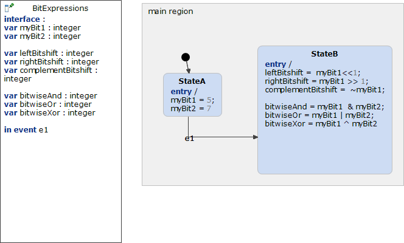

# BitExpressions 



```xml
<?xml version="1.0" encoding="UTF-8"?>
<scxml xmlns="http://www.w3.org/2005/07/scxml" version="1.0" datamodel="ecmascript" name="BitExpressions">
	<datamodel>
		<data expr="0" id="myBit1" />
		<data expr="0" id="myBit2" />
		<data expr="0" id="leftBitshift" />
		<data expr="0" id="rightBitshift" />
		<data expr="0" id="complementBitshift" />
		<data expr="0" id="bitwiseAnd" />
		<data expr="0" id="bitwiseOr" />
		<data expr="0" id="bitwiseXor" />
	</datamodel>
	<state id="main_region">
		<initial>
			<transition target="StateA" type="internal" >
			</transition>
		</initial>
		<state id="StateA">
			<onentry>
					 <assign location="myBit1" expr="5"/>
					 <assign location="myBit2" expr="7"/>
			</onentry>
			<transition event="e1"  target="StateB">
			</transition>
		</state>
		<state id="StateB">
			<onentry>
					 <assign location="leftBitshift" expr="myBit1 &lt;&lt; 1"/>
					 <assign location="rightBitshift" expr="myBit1 &gt;&gt; 1"/>
					 <assign location="complementBitshift" expr="~myBit1"/>
					 <assign location="bitwiseAnd" expr="myBit1 &amp; myBit2"/>
					 <assign location="bitwiseOr" expr="myBit1 | myBit2"/>
					 <assign location="bitwiseXor" expr="myBit1 ^ myBit2"/>
			</onentry>
		</state>
	</state>
</scxml>
```
