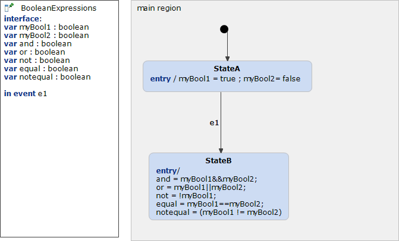

# BooleanExpressions 



```xml
<?xml version="1.0" encoding="UTF-8"?>
<scxml xmlns="http://www.w3.org/2005/07/scxml" version="1.0" datamodel="ecmascript" name="BooleanExpressions">
	<datamodel>
		<data expr="false" id="myBool1" />
		<data expr="false" id="myBool2" />
		<data expr="false" id="and" />
		<data expr="false" id="or" />
		<data expr="false" id="not" />
		<data expr="false" id="equal" />
		<data expr="false" id="notequal" />
	</datamodel>
	<state id="main_region">
		<initial>
			<transition target="StateA" type="internal" >
			</transition>
		</initial>
		<state id="StateA">
			<onentry>
				 <assign location="myBool1" expr="true"/>
				 <assign location="myBool2" expr="false"/>
			</onentry>
			<transition event="e1"  target="StateB">
			</transition>
		</state>
		<state id="StateB">
			<onentry>
				 <assign location="and" expr="myBool1 &amp;&amp; myBool2"/>
				 <assign location="or" expr="myBool1 || myBool2"/>
				 <assign location="not" expr="!myBool1"/>
				 <assign location="equal" expr="myBool1 == myBool2"/>
				 <assign location="notequal" expr="(myBool1 != myBool2)"/>
			</onentry>
		</state>
	</state>
</scxml>
```
