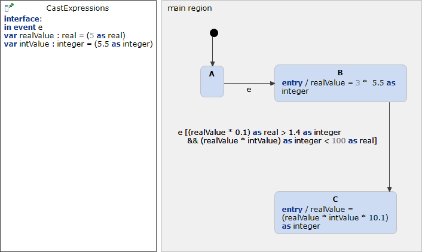

# CastExpressions 



```xml
<?xml version="1.0" encoding="UTF-8"?>
<scxml xmlns="http://www.w3.org/2005/07/scxml" version="1.0" datamodel="ecmascript" name="CastExpressions">
	<datamodel>
		<data expr="(5)" id="realValue" />
		<data expr="(Math.floor(5.5))" id="intValue" />
	</datamodel>
	<state id="main_region">
		<initial>
			<transition target="A" type="internal" >
			</transition>
		</initial>
		<state id="A">
			<transition event="e"  target="B">
			</transition>
		</state>
		<state id="B">
			<onentry>
				 <assign location="realValue" expr="3 * Math.floor(5.5)"/>
			</onentry>
			<transition event="e" cond="(realValue * 0.1) &gt; Math.floor(1.4) &amp;&amp; Math.floor((realValue * intValue)) &lt; 100" target="C">
			</transition>
		</state>
		<state id="C">
			<onentry>
				 <assign location="realValue" expr="Math.floor((realValue * intValue * 10.1))"/>
			</onentry>
		</state>
	</state>
</scxml>
```
