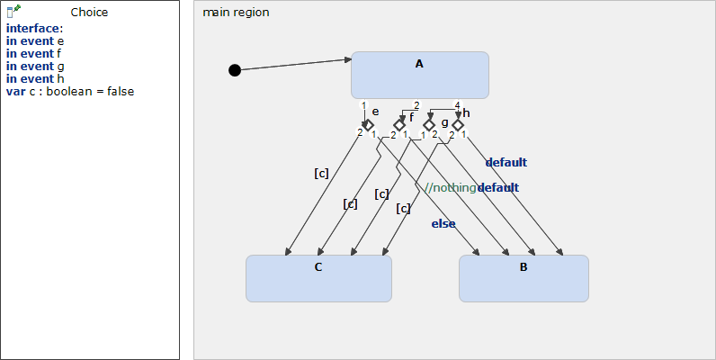

# Choice 



```xml
<?xml version="1.0" encoding="UTF-8"?>
<scxml xmlns="http://www.w3.org/2005/07/scxml" version="1.0" datamodel="ecmascript" name="Choice">
	<datamodel>
		<data expr="false" id="c" />
	</datamodel>
	<state id="main_region">
		<initial>
			<transition target="A" type="internal" >
			</transition>
		</initial>
		<state id="A">
			<transition event="e"  target="Choice.choice_0">
			</transition>
			<transition event="f"  target="Choice.choice_2">
			</transition>
			<transition event="g"  target="Choice.choice_1">
			</transition>
			<transition event="h"  target="Choice.choice_3">
			</transition>
		</state>
		<state id="Choice.choice_0">
			<transition  cond="c" target="C">
			</transition>
			<transition   target="B">
			</transition>
		</state>
		<state id="B">
		</state>
		<state id="C">
		</state>
		<state id="Choice.choice_1">
			<transition  cond="c" target="C">
			</transition>
			<transition   target="B">
			</transition>
		</state>
		<state id="Choice.choice_2">
			<transition  cond="c" target="C">
			</transition>
			<transition   target="B">
			</transition>
		</state>
		<state id="Choice.choice_3">
			<transition  cond="c" target="C">
			</transition>
			<transition   target="B">
			</transition>
		</state>
	</state>
</scxml>
```
