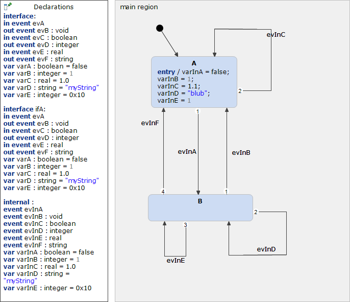

# Declarations 



```xml
<?xml version="1.0" encoding="UTF-8"?>
<scxml xmlns="http://www.w3.org/2005/07/scxml" version="1.0" datamodel="ecmascript" name="Declarations">
	<datamodel>
		<data expr="false" id="varA" />
		<data expr="1" id="varB" />
		<data expr="1.0" id="varC" />
		<data expr="'myString'" id="varD" />
		<data expr="0x10" id="varE" />
		<data expr="false" id="ifA_varA" />
		<data expr="1" id="ifA_varB" />
		<data expr="1.0" id="ifA_varC" />
		<data expr="'myString'" id="ifA_varD" />
		<data expr="0x10" id="ifA_varE" />
		<data expr="false" id="varInA" />
		<data expr="1" id="varInB" />
		<data expr="1.0" id="varInC" />
		<data expr="'myString'" id="varInD" />
		<data expr="0x10" id="varInE" />
	</datamodel>
	<state id="main_region">
		<initial>
			<transition target="A" type="internal" >
			</transition>
		</initial>
		<state id="A">
			<onentry>
				 <assign location="varInA" expr="false"/>
				 <assign location="varInB" expr="1"/>
				 <assign location="varInC" expr="1.1"/>
				 <assign location="varInD" expr="'blub'"/>
				 <assign location="varInE" expr="1"/>
			</onentry>
			<transition event="evInA"  target="B">
			</transition>
			<transition event="evInC"  target="A">
			</transition>
		</state>
		<state id="B">
			<transition event="evInB"  target="A">
			</transition>
			<transition event="evInD"  target="B">
			</transition>
			<transition event="evInE"  target="B">
			</transition>
			<transition event="evInF"  target="A">
			</transition>
		</state>
	</state>
</scxml>
```
