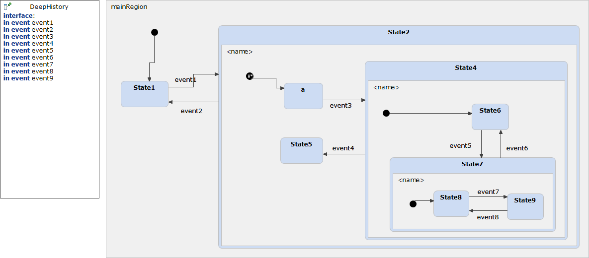

# DeepHistory 



```xml
<?xml version="1.0" encoding="UTF-8"?>
<scxml xmlns="http://www.w3.org/2005/07/scxml" version="1.0" datamodel="ecmascript" name="DeepHistory">
	<state id="mainRegion">
		<initial>
			<transition target="State1" type="internal" >
			</transition>
		</initial>
		<state id="State1">
			<transition event="event1"  target="State2">
			</transition>
		</state>
		<state id="State2">
			<initial>
				<transition target="State2.entry_0" type="internal" >
				</transition>
			</initial>
			<state id="a">
				<transition event="event3"  target="State4">
				</transition>
			</state>
			<state id="State4">
				<initial>
					<transition target="State6" type="internal" >
					</transition>
				</initial>
				<state id="State6">
					<transition event="event5"  target="State7">
					</transition>
				</state>
				<state id="State7">
					<initial>
						<transition target="State8" type="internal" >
						</transition>
					</initial>
					<state id="State8">
						<transition event="event7"  target="State9">
						</transition>
					</state>
					<state id="State9">
						<transition event="event8"  target="State8">
						</transition>
					</state>
					<transition event="event6"  target="State6">
					</transition>
				</state>
				<transition event="event4"  target="State5">
				</transition>
			</state>
			<state id="State5">
			</state>
			<history type="deep" id="State2.entry_0">
				<transition   target="a">
				</transition>
			</history>
			<transition event="event2"  target="State1">
			</transition>
		</state>
	</state>
</scxml>
```
