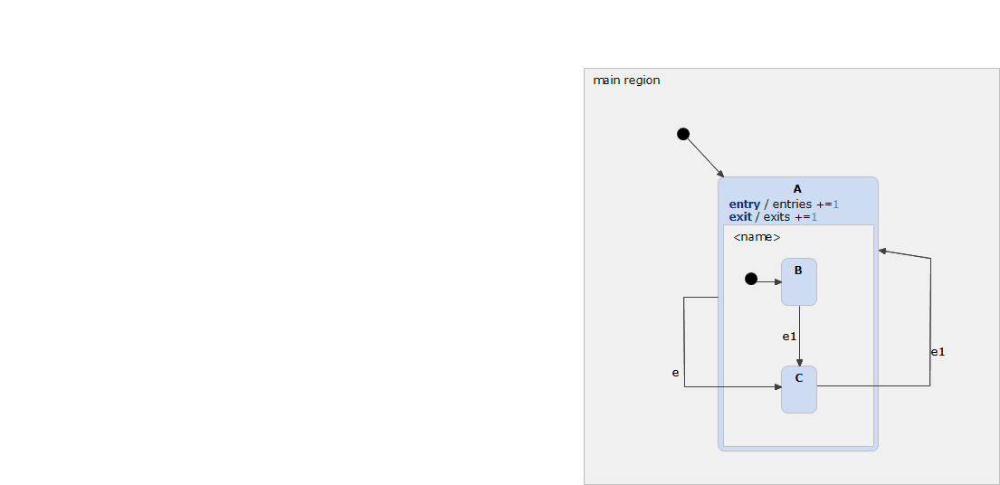

# EntryExitSelfTransition 



```xml
<?xml version="1.0" encoding="UTF-8"?>
<scxml xmlns="http://www.w3.org/2005/07/scxml" version="1.0" datamodel="ecmascript" name="EntryExitSelfTransition">
	<datamodel>
		<data expr="0" id="exits" />
		<data expr="0" id="entries" />
	</datamodel>
	<state id="main_region">
		<initial>
			<transition target="A" type="internal" >
			</transition>
		</initial>
		<state id="A">
			<onentry>
					 <assign location="entries" expr="entries + 1"/>
			</onentry>
			<onexit>
					 <assign location="exits" expr="exits + 1"/>
			</onexit>
			<initial>
				<transition target="B" type="internal" >
				</transition>
			</initial>
			<state id="B">
				<transition event="e1"  target="C">
				</transition>
			</state>
			<state id="C">
				<transition event="e1"  target="A">
				</transition>
			</state>
			<transition event="e"  target="C">
			</transition>
		</state>
	</state>
</scxml>
```
