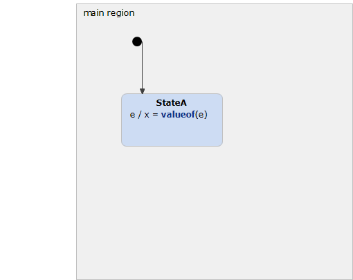

# EventWithPayload 



```xml
<?xml version="1.0" encoding="UTF-8"?>
<scxml xmlns="http://www.w3.org/2005/07/scxml" version="1.0" datamodel="ecmascript" name="EventWithPayload">
	<datamodel>
		<data expr="0" id="x" />
	</datamodel>
	<state id="main_region">
		<initial>
			<transition target="StateA" type="internal" >
			</transition>
		</initial>
		<state id="StateA">
			<transition event ="e" cond="" type="internal" >
				 <assign location="x" expr="_event.data"/>
			</transition>
		</state>
	</state>
</scxml>
```
