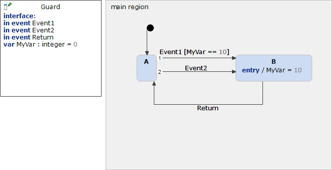

# Guard 



```xml
<?xml version="1.0" encoding="UTF-8"?>
<scxml xmlns="http://www.w3.org/2005/07/scxml" version="1.0" datamodel="ecmascript" name="Guard">
	<datamodel>
		<data expr="0" id="MyVar" />
	</datamodel>
	<state id="main_region">
		<initial>
			<transition target="A" type="internal" >
			</transition>
		</initial>
		<state id="A">
			<transition event="Event1" cond="MyVar == 10" target="B">
			</transition>
			<transition event="Event2"  target="B">
			</transition>
		</state>
		<state id="B">
			<onentry>
					 <assign location="MyVar" expr="10"/>
			</onentry>
			<transition event="Return"  target="A">
			</transition>
		</state>
	</state>
</scxml>
```
