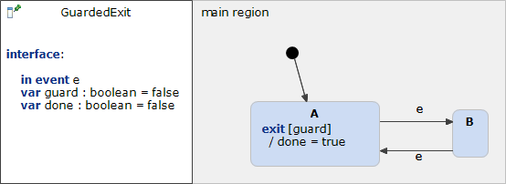

# GuardedExit 



```xml
<?xml version="1.0" encoding="UTF-8"?>
<scxml xmlns="http://www.w3.org/2005/07/scxml" version="1.0" datamodel="ecmascript" name="GuardedExit">
	<datamodel>
		<data expr="false" id="guard" />
		<data expr="false" id="done" />
	</datamodel>
	<state id="main_region">
		<initial>
			<transition target="A" type="internal" >
			</transition>
		</initial>
		<state id="A">
			<onexit>
				<if cond="guard">
				 <assign location="done" expr="true"/>
				</if>
			</onexit>
			<transition event="e"  target="B">
			</transition>
		</state>
		<state id="B">
			<transition event="e"  target="A">
			</transition>
		</state>
	</state>
</scxml>
```
