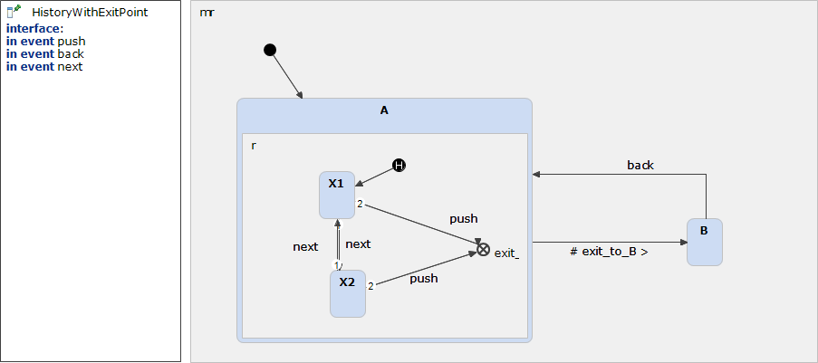

# HistoryWithExitPoint 



```xml
<?xml version="1.0" encoding="UTF-8"?>
<scxml xmlns="http://www.w3.org/2005/07/scxml" version="1.0" datamodel="ecmascript" name="HistoryWithExitPoint">
	<state id="mr">
		<initial>
			<transition target="A" type="internal" >
			</transition>
		</initial>
		<state id="A">
			<initial>
				<transition target="A.entry_0" type="internal" >
				</transition>
			</initial>
			<state id="X1">
				<transition event="next"  target="X2">
				</transition>
				<transition event="push"  target="B">
				</transition>
			</state>
			<state id="X2">
				<transition event="next"  target="X1">
				</transition>
				<transition event="push"  target="B">
				</transition>
			</state>
			<history type = "shallow" id="A.entry_0">
				<transition   target="X1">
				</transition>
			</history>
		</state>
		<state id="B">
			<transition event="back"  target="A">
			</transition>
		</state>
	</state>
</scxml>
```
