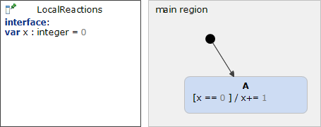

# LocalReactions 



```xml
<?xml version="1.0" encoding="UTF-8"?>
<scxml xmlns="http://www.w3.org/2005/07/scxml" version="1.0" datamodel="ecmascript" name="LocalReactions">
	<datamodel>
		<data expr="0" id="x" />
	</datamodel>
	<state id="main_region">
		<initial>
			<transition target="A" type="internal" >
			</transition>
		</initial>
		<state id="A">
			<transition cond="x == 0" type="internal" >
				 <assign location="x" expr="x + 1"/>
			</transition>
		</state>
	</state>
</scxml>
```
