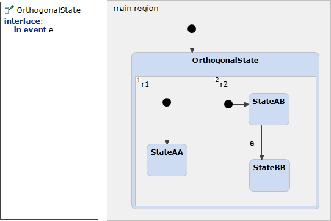

# OrthogonalState 



```xml
<?xml version="1.0" encoding="UTF-8"?>
<scxml xmlns="http://www.w3.org/2005/07/scxml" version="1.0" datamodel="ecmascript" name="OrthogonalState">
	<state id="main_region">
		<initial>
			<transition target="OrthogonalState" type="internal" >
			</transition>
		</initial>
		<parallel id="OrthogonalState">
			<state id="r1">
				<initial>
					<transition target="StateAA" type="internal" >
					</transition>
				</initial>
				<state id="StateAA">
				</state>
			</state>
			<state id="r2">
				<initial>
					<transition target="StateAB" type="internal" >
					</transition>
				</initial>
				<state id="StateAB">
					<transition event="e"  target="StateBB">
					</transition>
				</state>
				<state id="StateBB">
				</state>
			</state>
		</parallel>
	</state>
</scxml>
```
