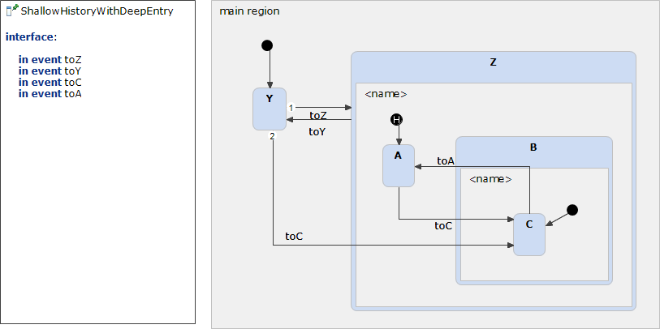

# ShallowHistoryWithDeepEntry 



```xml
<?xml version="1.0" encoding="UTF-8"?>
<scxml xmlns="http://www.w3.org/2005/07/scxml" version="1.0" datamodel="ecmascript" name="ShallowHistoryWithDeepEntry">
	<state id="main_region">
		<initial>
			<transition target="Y" type="internal" >
			</transition>
		</initial>
		<state id="Y">
			<transition event="toZ"  target="Z">
			</transition>
			<transition event="toC"  target="C">
			</transition>
		</state>
		<state id="Z">
			<initial>
				<transition target="Z.entry_0" type="internal" >
				</transition>
			</initial>
			<history type = "shallow" id="Z.entry_0">
				<transition   target="A">
				</transition>
			</history>
			<state id="A">
				<transition event="toC"  target="C">
				</transition>
			</state>
			<state id="B">
				<initial>
					<transition target="C" type="internal" >
					</transition>
				</initial>
				<state id="C">
					<transition event="toA"  target="A">
					</transition>
				</state>
			</state>
			<transition event="toY"  target="Y">
			</transition>
		</state>
	</state>
</scxml>
```
