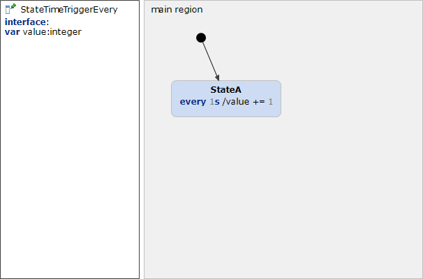

# StateTimeTriggerEvery 



```xml
<?xml version="1.0" encoding="UTF-8"?>
<scxml xmlns="http://www.w3.org/2005/07/scxml" version="1.0" datamodel="ecmascript" name="StateTimeTriggerEvery">
	<datamodel>
		<data expr="0" id="value" />
	</datamodel>
	<state id="main_region">
		<initial>
			<transition target="StateA" type="internal" >
			</transition>
		</initial>
		<state id="StateA">
			<onentry>
				<send event="StateA_timeEvent_0" delay="1s"/>
			</onentry>
			<transition event="StateA_timeEvent_0" cond="">
				 <assign location="value" expr="value + 1"/>
				<send event="StateA_timeEvent_0" delay="1s"/>
			</transition>
			<onexit>
				<cancel sendid="StateA_timeEvent_0" />
			</onexit>
		</state>
	</state>
</scxml>
```
