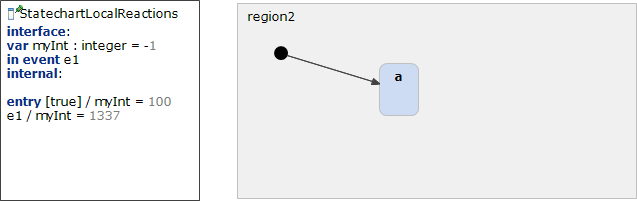

# StatechartLocalReactions 



```xml
<?xml version="1.0" encoding="UTF-8"?>
<scxml xmlns="http://www.w3.org/2005/07/scxml" version="1.0" datamodel="ecmascript" name="StatechartLocalReactions">
	<datamodel>
		<data expr="-1" id="myInt" />
	</datamodel>
	<state id="region2">
		<initial>
			<transition target="a" type="internal" >
			</transition>
		</initial>
		<state id="a">
		</state>
		<onentry>
			<if cond="true">
			 <assign location="myInt" expr="100"/>
			</if>
		</onentry>
		<transition event ="e1" cond="" type="internal" >
			 <assign location="myInt" expr="1337"/>
		</transition>
	</state>
</scxml>
```
