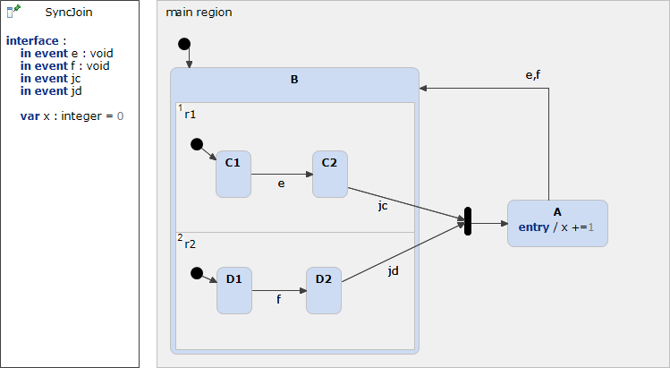

# SyncJoin 



```xml
<?xml version="1.0" encoding="UTF-8"?>
<scxml xmlns="http://www.w3.org/2005/07/scxml" version="1.0" datamodel="ecmascript" name="SyncJoin">
	<datamodel>
		<data expr="0" id="x" />
	</datamodel>
	<state id="main_region">
		<initial>
			<transition target="B" type="internal" >
			</transition>
		</initial>
		<state id="A">
			<onentry>
				 <assign location="x" expr="x + 1"/>
			</onentry>
			<transition event="e"  target="B">
			</transition>
			<transition event="f"  target="B">
			</transition>
		</state>
		<parallel id="B">
			<state id="r1">
				<initial>
					<transition target="C1" type="internal" >
					</transition>
				</initial>
				<state id="C1">
					<transition event="e"  target="C2">
					</transition>
				</state>
				<state id="C2">
				</state>
			</state>
			<state id="r2">
				<initial>
					<transition target="D1" type="internal" >
					</transition>
				</initial>
				<state id="D1">
					<transition event="f"  target="D2">
					</transition>
				</state>
				<state id="D2">
				</state>
			</state>
			<transition event="jd" cond="In('D2') &amp;&amp; In('C2')" target="A">
			</transition>
			<transition event="jc" cond="In('D2') &amp;&amp; In('C2')" target="A">
			</transition>
		</parallel>
	</state>
</scxml>
```
