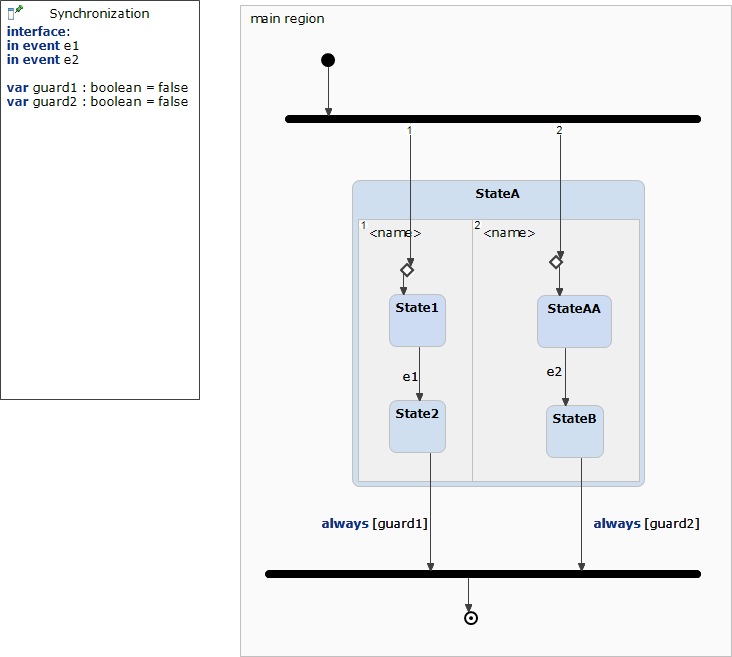

# Synchronization 



```xml
<?xml version="1.0" encoding="UTF-8"?>
<scxml xmlns="http://www.w3.org/2005/07/scxml" version="1.0" datamodel="ecmascript" name="Synchronization">
	<datamodel>
		<data expr="false" id="guard1" />
		<data expr="false" id="guard2" />
	</datamodel>
	<state id="main_region">
		<initial>
			<transition target="StateA._r0.choice_0 StateA._r1.choice_0" type="internal" >
			</transition>
		</initial>
		<parallel id="StateA">
			<state id="_r0">
				<initial>
					<transition target="State1" type="internal" >
					</transition>
				</initial>
				<state id="State1">
					<transition event="e1"  target="State2">
					</transition>
				</state>
				<state id="StateA._r0.choice_0">
					<transition   target="State1">
					</transition>
				</state>
				<state id="State2">
				</state>
			</state>
			<state id="_r1">
				<initial>
					<transition target="StateAA" type="internal" >
					</transition>
				</initial>
				<state id="StateAA">
					<transition event="e2"  target="StateB">
					</transition>
				</state>
				<state id="StateA._r1.choice_0">
					<transition   target="StateAA">
					</transition>
				</state>
				<state id="StateB">
				</state>
			</state>
			<transition  cond="guard2 &amp;&amp; guard1 &amp;&amp; In('StateB') &amp;&amp; In('State2')" target="final_0">
			</transition>
			<transition  cond="guard2 &amp;&amp; guard1 &amp;&amp; In('StateB') &amp;&amp; In('State2')" target="final_0">
			</transition>
		</parallel>
		<final id="final_0"/>	
	</state>
</scxml>
```
