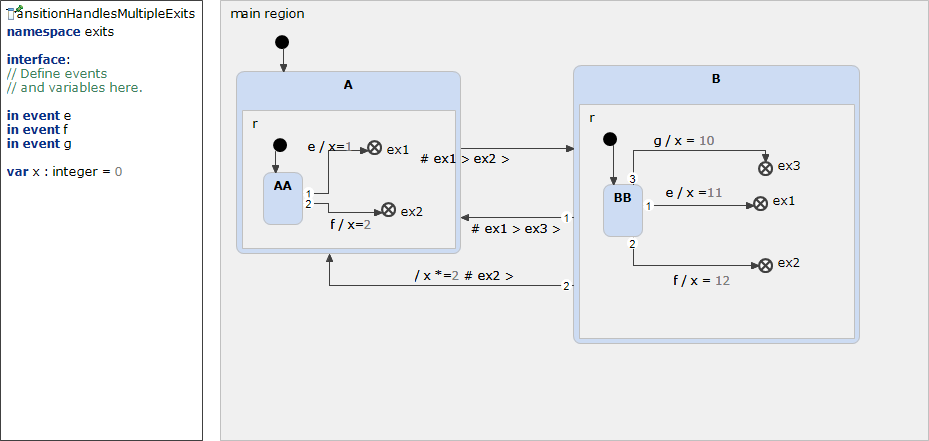

# TransitionHandlesMultipleExits 



```xml
<?xml version="1.0" encoding="UTF-8"?>
<scxml xmlns="http://www.w3.org/2005/07/scxml" version="1.0" datamodel="ecmascript" name="TransitionHandlesMultipleExits">
	<datamodel>
		<data expr="0" id="x" />
	</datamodel>
	<state id="main_region">
		<initial>
			<transition target="A" type="internal" >
			</transition>
		</initial>
		<state id="A">
			<initial>
				<transition target="AA" type="internal" >
				</transition>
			</initial>
			<state id="AA">
				<transition event="e"  target="B">
					 <assign location="x" expr="1"/>
				</transition>
				<transition event="f"  target="B">
					 <assign location="x" expr="2"/>
				</transition>
			</state>
		</state>
		<state id="B">
			<initial>
				<transition target="BB" type="internal" >
				</transition>
			</initial>
			<state id="BB">
				<transition event="e"  target="A">
					 <assign location="x" expr="11"/>
				</transition>
				<transition event="f"  target="A">
					 <assign location="x" expr="12"/>
					 <assign location="x" expr="x * 2"/>
				</transition>
				<transition event="g"  target="A">
					 <assign location="x" expr="10"/>
				</transition>
			</state>
		</state>
	</state>
</scxml>
```
