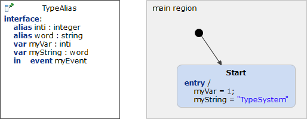

# TypeAlias 



```xml
<?xml version="1.0" encoding="UTF-8"?>
<scxml xmlns="http://www.w3.org/2005/07/scxml" version="1.0" datamodel="ecmascript" name="TypeAlias">
	<datamodel>
		<data expr="0" id="myVar" />
		<data expr="" id="myString" />
	</datamodel>
	<state id="main_region">
		<initial>
			<transition target="Start" type="internal" >
			</transition>
		</initial>
		<state id="Start">
			<onentry>
					 <assign location="myVar" expr="1"/>
					 <assign location="myString" expr="'TypeSystem'"/>
			</onentry>
		</state>
	</state>
</scxml>
```
