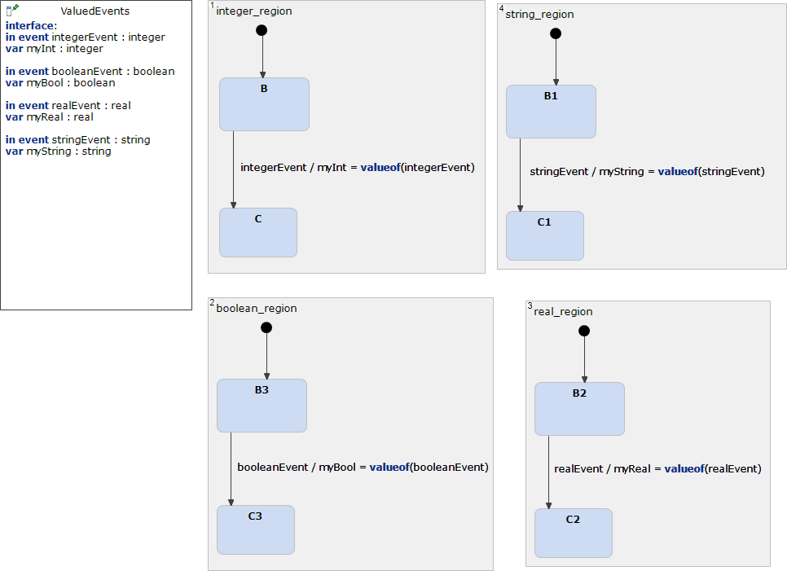

# ValuedEvents 



```xml
<?xml version="1.0" encoding="UTF-8"?>
<scxml xmlns="http://www.w3.org/2005/07/scxml" version="1.0" datamodel="ecmascript" name="ValuedEvents">
	<datamodel>
		<data expr="0" id="myInt" />
		<data expr="false" id="myBool" />
		<data expr="0.0" id="myReal" />
		<data expr="" id="myString" />
	</datamodel>
	<parallel>
	<state id="integer_region">
		<initial>
			<transition target="B" type="internal" >
			</transition>
		</initial>
		<state id="B">
			<transition event="integerEvent"  target="C">
				 <assign location="myInt" expr="_event.data"/>
			</transition>
		</state>
		<state id="C">
		</state>
	</state>
	<state id="boolean_region">
		<initial>
			<transition target="B3" type="internal" >
			</transition>
		</initial>
		<state id="B3">
			<transition event="booleanEvent"  target="C3">
				 <assign location="myBool" expr="_event.data"/>
			</transition>
		</state>
		<state id="C3">
		</state>
	</state>
	<state id="real_region">
		<initial>
			<transition target="B2" type="internal" >
			</transition>
		</initial>
		<state id="B2">
			<transition event="realEvent"  target="C2">
				 <assign location="myReal" expr="_event.data"/>
			</transition>
		</state>
		<state id="C2">
		</state>
	</state>
	<state id="string_region">
		<initial>
			<transition target="B1" type="internal" >
			</transition>
		</initial>
		<state id="B1">
			<transition event="stringEvent"  target="C1">
				 <assign location="myString" expr="_event.data"/>
			</transition>
		</state>
		<state id="C1">
		</state>
	</state>
	</parallel>
</scxml>
```
